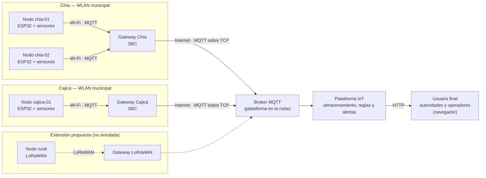
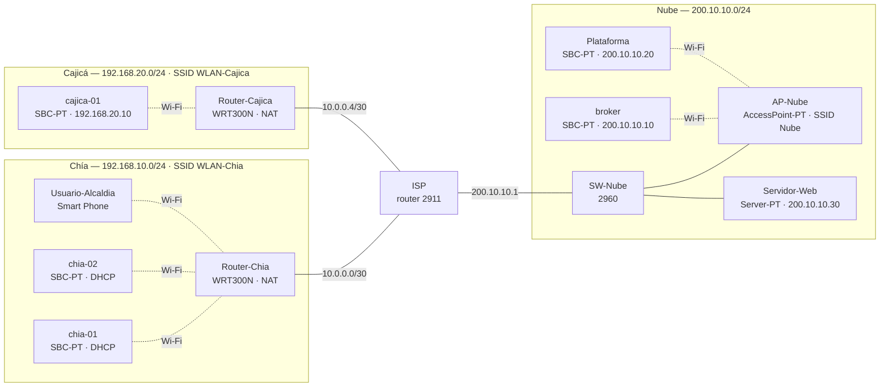

# Actividad de refuerzo 2.3 — Conectividad en IoT

Equipo 7 · Internet de las Cosas 2026-2 · Universidad de La Sabana.

> Esta actividad extiende el dispositivo del Challenge #2 a una red de varios nodos con MQTT, un gateway y una plataforma en la nube. **El prototipo del Challenge #2 no usa MQTT:** su tablero se aloja en el propio ESP32 dentro de la WLAN local (ver la sección 2.2 de la [Wiki del Challenge #2](https://github.com/Majo7-613/IoT-Challenge2-UniSabana/wiki/2.2.-Restricciones-de-Diseño)). Las referencias de esta página se numeran de forma independiente.

## 1. Proceso y necesidad de conectividad

El Challenge #2 monitorea un punto de almacenamiento de agua en Sabana Centro. Esta actividad imagina ese dispositivo replicado en varios puntos críticos de la región —tanques y reservorios de acueductos veredales en municipios como Chía y Cajicá— formando una red inalámbrica de sensores.

La conectividad aporta lo que un nodo aislado no puede dar:

* **Vista regional:** las autoridades comparan en un mismo tablero el nivel y las condiciones de todos los puntos.
* **Alertas fuera del sitio:** una alerta de un nodo llega a quien no está cerca del tanque.
* **Histórico centralizado:** los datos de cada nodo se conservan en la plataforma aunque el nodo se reinicie.

## 2. Tipo de red

| Tipo de red | Alcance | Consumo | Volumen de datos | ¿Encaja en la red de Sabana Centro? |
| :--- | :--- | :--- | :--- | :--- |
| **PAN** (por ejemplo, Bluetooth o ZigBee sobre IEEE 802.15.4 [5]) | Corto: pensadas para dispositivos cercanos entre sí | Bajo | Bajo a medio | No como enlace principal: los puntos de almacenamiento están separados por kilómetros. |
| **WLAN** (IEEE 802.11 [4]) | El área de cobertura de cada punto de acceso | Mayor que PAN y LPWAN | Alto | Sí, en los puntos donde la alcaldía provee una WLAN, como en el caso del Challenge. |
| **LPWAN** (por ejemplo, LoRaWAN) | Del orden de kilómetros: 5 km en zona urbana y 15 km en zona rural para LoRaWAN [3] | Muy bajo: buscan una duración de batería de 10 años o más [3] | Muy bajo: de 0.3 a 37.5 kbps con modulación LoRa (50 kbps con FSK) y cargas útiles de hasta 250 B según la configuración y la región [3] | Sí, para tanques rurales sin Wi-Fi, con mensajes pequeños y poco frecuentes. |

**Decisión: arquitectura híbrida.** Los nodos se conectan por Wi-Fi a la WLAN municipal donde existe, y un gateway por municipio —una computadora de placa única (SBC)— reúne sus datos y los envía por Internet a una plataforma en la nube mediante MQTT. LoRaWAN se propone como extensión para puntos rurales sin Wi-Fi; no se incluye en la simulación de esta actividad.

## 3. Ecosistema IoT completo



| Componente | En el diseño | Función |
| :--- | :--- | :--- |
| Dispositivos | Nodos ESP32 con sensores de nivel, temperatura, humedad, presión y UV | Miden y publican telemetría, alertas y su estado de conexión. |
| Gateway | Una SBC por municipio | Reúne los mensajes de los nodos de la WLAN municipal y los reenvía a la nube por Internet. |
| Conectividad a Internet | Enlace del municipio a un proveedor de Internet | Transporta el tráfico MQTT del gateway a la plataforma. |
| Plataforma IoT | Broker MQTT, almacenamiento y reglas en la nube | Recibe y guarda los datos de todos los nodos y genera alertas regionales. |
| Usuario final | Autoridades y operadores con un navegador | Consultan el tablero de la plataforma por HTTP [7]. |

## 4. Protocolos por capa

| Capa | Protocolo | Uso en el ecosistema |
| :--- | :--- | :--- |
| Acceso | IEEE 802.11 [4] | Enlace de los nodos con el punto de acceso de la WLAN municipal. |
| Red | IPv4, con direcciones asignadas por DHCP | Direccionamiento de nodos, gateways y servidores. |
| Transporte | TCP | Conexión persistente de los clientes MQTT con el broker; puerto 1883 sin TLS y 8883 con TLS, ambos registrados en IANA [1]. |
| Aplicación | MQTT [1], [2] | Telemetría, alertas, estado y órdenes entre nodos, gateway y plataforma. |
| Aplicación | HTTP [7] | Acceso del usuario al tablero de la plataforma. |

## 5. ¿Por qué MQTT?

* **Publicación/suscripción:** los nodos publican en tópicos y no necesitan conocer a los suscriptores; agregar un tablero o una regla nueva no cambia el firmware de los nodos [1].
* **Encabezado pequeño:** el encabezado fijo de un paquete MQTT ocupa desde 2 bytes [1], lo que conviene a nodos con conectividad limitada.
* **Tres niveles de calidad de servicio:** QoS 0 (a lo sumo una vez), QoS 1 (al menos una vez) y QoS 2 (exactamente una vez) [1]; cada tipo de mensaje usa el nivel que necesita.
* **Mensajes retenidos:** el broker guarda el último mensaje retenido de un tópico y lo entrega a quien se suscriba después [1]; así el tablero conoce de inmediato si un nodo está en línea.
* **Última voluntad (LWT):** el broker publica el mensaje de última voluntad de un cliente cuando su conexión se cierra de forma anormal [1]; así se detectan nodos caídos sin consultarlos.
* **Comodines en las suscripciones:** con `+` y `#` [1], la plataforma se suscribe a todos los nodos de un municipio o de la región con una sola suscripción.

## 6. Diseño de tópicos

Estructura: `sabana/{municipio}/{nodo}/{tipo}`.

| Tópico | Publica | Se suscribe | QoS | Retenido | Contenido |
| :--- | :--- | :--- | :--- | :--- | :--- |
| `sabana/{municipio}/{nodo}/telemetria` | Nodo | Plataforma (`sabana/+/+/telemetria`) | 0 | No | JSON con nivel, tendencia, temperatura, humedad, presión, UV, VPD y estado, cada 60 s |
| `sabana/{municipio}/{nodo}/alerta` | Nodo | Plataforma y tablero (`sabana/+/+/alerta`) | 1 | No | Estado de alerta y causa, en cada cambio de estado |
| `sabana/{municipio}/{nodo}/estado` | Nodo al conectarse (`online`) y el broker por la LWT (`offline`) | Plataforma (`sabana/+/+/estado`) | 1 | Sí | `online` / `offline` |
| `sabana/{municipio}/{nodo}/cmd/desactivar_alarma` | Plataforma, por orden de un usuario autorizado | Nodo | 1 | No | Orden de desactivar la alarma física del nodo |

**Justificación de QoS y retención:**

* **Telemetría en QoS 0:** llega cada minuto; perder una muestra no afecta la tendencia y evita tráfico de confirmaciones.
* **Alertas y órdenes en QoS 1:** deben llegar; un duplicado no hace daño, porque el mensaje repite el estado vigente o la misma orden.
* **Estado retenido con LWT:** cada nodo se conecta con una LWT en `.../estado` con carga `offline`, QoS 1 y retenida, y al conectarse publica `online`, retenido. Un tablero que se abre después ve el último estado de cada nodo.

## 7. Volumen de datos

Ejemplo de mensaje de telemetría (JSON compacto, 166 bytes):

```json
{"nodo":"chia-01","ciclo":123456,"nivel_cm":12.3,"nivel_pct":41,"tend_cm_min":-0.4,"t_c":18.2,"hr_pct":71,"p_hpa":752.4,"uv_idx":1.2,"vpd_kpa":0.61,"estado":"NORMAL"}
```

| Concepto | Cálculo | Resultado |
| :--- | :--- | :--- |
| Paquete PUBLISH con QoS 0 | 3 B de encabezado fijo + 2 B de longitud del tópico + 30 B del tópico `sabana/chia/chia-01/telemetria` + 166 B de carga útil | 201 B |
| Mensajes por día | Un mensaje cada 60 s | 1 440 |
| Volumen diario por nodo (sin TCP/IP) | 1 440 × 201 B | Unos 289 kB |

En la simulación de Packet Tracer se usó un mensaje más corto, escrito a mano en la aplicación *MQTT Client* (94 B de carga útil):

```json
{"nivel_cm":64.0,"t_c":23.1,"hr":55,"p_hpa":751.8,"uv":4.1,"vpd_kpa":1.27,"origen":"simulado"}
```

Con el tópico `sabana/cajica/cajica-01/telemetria` (34 B), el paquete PUBLISH ocupa 2 B de encabezado fijo + 2 B de longitud del tópico + 34 B + 94 B = 132 B, y a un mensaje por minuto serían unos 190 kB diarios por nodo.

El volumen es bajo para una WLAN. Para la extensión LoRaWAN, en cambio, la carga útil debería codificarse en binario (unos pocos bytes por variable) y la frecuencia de envío reducirse, porque la carga útil máxima puede ser de hasta 250 B según la configuración y la región [3].

## 8. Validación en Cisco Packet Tracer

La validación se realizó en **Cisco Packet Tracer 9.0.0.810** [6]. El archivo de la simulación es [`red-sabana-centro.pkt`](red-sabana-centro.pkt) y las capturas están en [`capturas/`](capturas/). Los datos de los nodos son simulados y cada mensaje lo declara con `"origen":"simulado"`.

### 8.1. Topología construida

La topología simulada simplifica el ecosistema de la sección 3 en un punto: **no hay una SBC gateway por municipio**. El router inalámbrico de cada municipio cumple la función de gateway: enruta el tráfico de los nodos hacia el proveedor de Internet y aplica NAT. El gateway SBC con broker local se mantiene en el diseño real, pero no se simuló (ver 8.3 y 8.4).



| Red | Dirección | Dispositivos |
| :--- | :--- | :--- |
| LAN Chía | 192.168.10.0/24 | Router-Chia (WRT300N, 192.168.10.1, SSID WLAN-Chia); chia-01 y chia-02 por DHCP; Usuario-Alcaldia |
| LAN Cajicá | 192.168.20.0/24 | Router-Cajica (WRT300N, 192.168.20.1, SSID WLAN-Cajica); cajica-01 con IP estática 192.168.20.10 |
| Enlace Chía – ISP | 10.0.0.0/30 | Router-Chia (WAN 10.0.0.1), ISP g0/0 (10.0.0.2) |
| Enlace Cajicá – ISP | 10.0.0.4/30 | Router-Cajica (WAN 10.0.0.5), ISP g0/1 (10.0.0.6) |
| Red de la nube | 200.10.10.0/24 | ISP g0/2 (200.10.10.1, puerta de enlace); SW-Nube; AP-Nube (SSID Nube, sin autenticación); broker (200.10.10.10); Plataforma (200.10.10.20); Servidor-Web (200.10.10.30) |

* **Nombres visibles en Packet Tracer:** en el archivo `.pkt`, los nodos se llaman `chia1`, `chia2` y `cajica1`, la Plataforma se llama `platform` y el Router-Cajica aparece como «Wireless Router1». Esta página usa los nombres del diseño.
* **ISP:** router 2911 con rutas estáticas a 192.168.10.0/24 y 192.168.20.0/24.
* **AP-Nube:** en Packet Tracer 9, la SBC-PT solo trae interfaz inalámbrica y Bluetooth, así que el broker y la Plataforma se conectan a la red de la nube por un punto de acceso.
* **MQTT:** el broker y los clientes son las aplicaciones de Packet Tracer 9 instaladas desde la pestaña *Programming*, proyecto «MQTT Broker/Client - (Python)», con *Install to Desktop*. El broker tiene dos usuarios autorizados, `nodo` y `plataforma`, cada uno con su contraseña.

Capturas: [topología completa](capturas/01-topologia.png); [direccionamiento del ISP](capturas/02-direccionamiento-router-isp.png), con g0/0, g0/1 y g0/2 en *up/up*, las redes conectadas 10.0.0.0/30, 10.0.0.4/30 y 200.10.10.0/24 y las rutas estáticas a 192.168.10.0/24 (vía 10.0.0.1) y 192.168.20.0/24 (vía 10.0.0.5); [usuarios autorizados del broker](capturas/04-broker-config.png).

### 8.2. Pruebas realizadas

| # | Prueba | Resultado esperado | Resultado observado | Evidencia |
| :--- | :--- | :--- | :--- | :--- |
| P1 | `ping` de un nodo al broker | Respuestas del broker | chia-01 (192.168.10.100/24, puerta de enlace 192.168.10.1, asignadas por DHCP) recibió 4 de 4 respuestas del broker, sin pérdidas. En el primer `ping` de cada nodo se pierde 1 de 4 paquetes, por la resolución ARP inicial. | [03](capturas/03-ping-nodo-broker.png) |
| P2 | Conexión de la Plataforma al broker | CONNECT y CONNACK con código 0 | CONNECT con protocolo MQTT 3.1.1, usuario `plataforma`, y CONNACK con `returnCode 0`. | [05](capturas/05-connect-connack.png) · simulación de los paquetes (05b-simulacion-mqtt): no tomada |
| P3 | Suscripción de la Plataforma | SUBSCRIBE y SUBACK a `sabana/#` | Suscripción aceptada: SUBSCRIBE y SUBACK a `sabana/#`. | [06](capturas/06-subscribe.png) · [05c](capturas/05c-plataforma-event-log.png) |
| P4 | Telemetría de un nodo | La Plataforma recibe el PUBLISH de chia-01 | chia-01 publicó en `sabana/chia/chia-01/telemetria` con QoS 0 y la Plataforma recibió el mensaje. | [07-a](capturas/07-publish-telemetria-a.png) (publicación en chia-01) · [07-b](capturas/07-publish-telemetria-b.png) (mensaje en la Plataforma) |
| P5 | Telemetría de los dos municipios | La Plataforma recibe los mensajes de Chía y Cajicá | La Plataforma recibió la telemetría de chia-01, chia-02 y cajica-01 con una sola suscripción. | [07b-a](capturas/07b-telemetria-dos-municipios-a.png) · [07b-b](capturas/07b-telemetria-dos-municipios-b.png) (publicación en cajica-01) · [05c](capturas/05c-plataforma-event-log.png) |
| P6 | Alerta con QoS 1 | PUBLISH con QoS 1 y confirmación PUBACK | chia-01 publicó `{"estado":"ALERTA","causa":"descenso+VPD"}` con QoS 1 y recibió PUBACK; la Plataforma recibió la alerta. | [08-a](capturas/08-alerta-qos1-a.png) (publicación) · [08-b](capturas/08-alerta-qos1-b.png) (registro de chia-01 con PUBACK) · [08-c](capturas/08-alerta-qos1-c.png) (mensaje en la Plataforma) |
| P7 | Orden de desactivar la alarma | chia-01 recibe la orden publicada por la Plataforma | La Plataforma publicó en `sabana/chia/chia-01/cmd/desactivar_alarma` con QoS 1 y recibió PUBACK; chia-01, suscrito a ese tópico, recibió la orden. | [10-a](capturas/10-orden-desactivar-a.png) (publicación en la Plataforma) · [10-b](capturas/10-orden-desactivar-b.png) (suscripción de chia-01) · [05c](capturas/05c-plataforma-event-log.png) (PUBACK). Recepción en el registro de chia-01 (10c): no tomada. |
| P8 | Estado retenido y LWT | Al desconectar un nodo, la Plataforma recibe `offline` | No se pudo probar: la aplicación *MQTT Client* de Packet Tracer no permite configurar la LWT (ver 8.4). | [05c](capturas/05c-plataforma-event-log.png) (`"will":{}` en el CONNECT) |
| P9 | Acceso del usuario por HTTP | El navegador del Usuario-Alcaldia abre el tablero | El Usuario-Alcaldia, conectado a WLAN-Chia, abrió `http://200.10.10.30` y vio la página del tablero. | [11](capturas/11-http-usuario.png) |

La página del Servidor-Web es estática: presenta el tablero y los tópicos, pero no muestra los datos que recibe la Plataforma. En un despliegue real, la plataforma guardaría los mensajes y el servidor web los presentaría.

### 8.3. Retos enfrentados y cómo se resolvieron

| Reto | Qué ocurrió | Cómo se resolvió |
| :--- | :--- | :--- |
| Conectar a la red de la nube el broker y la Plataforma | En Packet Tracer 9, la SBC-PT solo trae interfaz inalámbrica y Bluetooth; no se puede cablear al switch. | Se agregó el AP-Nube (AccessPoint-PT) conectado al SW-Nube, y el broker y la Plataforma se asociaron a él por Wi-Fi. |
| Gateway SBC por municipio | La SBC gateway de Chía, con IP estática, no respondía, y la interfaz gráfica del router de Cajicá no dejaba configurar el DHCP (falla 3 de la sección 9). | Se simplificó la topología: el router inalámbrico de cada municipio cumple la función de gateway (enrutamiento y NAT), y cajica-01 usa IP estática. El gateway SBC con broker local queda en el diseño real, no simulado. |
| Nodos sin dirección IP | Tras cambiar la IP de la LAN del WRT300N, los nodos quedaron con 0.0.0.0 (falla 2). | Se corrigió el rango del DHCP y se renovó la dirección de los nodos. |
| Última voluntad (LWT) | La aplicación *MQTT Client* no permite configurar la LWT. | No se simuló por otra vía; se documenta como limitación del simulador en 8.4. |

### 8.4. Limitaciones del simulador

| Limitación | Evidencia | Cómo funcionaría en un despliegue real |
| :--- | :--- | :--- |
| **Sin LWT:** la aplicación *MQTT Client* de Packet Tracer 9 no permite configurar la última voluntad; el CONNECT registra `"will":{}`. Por eso no se validó el tópico `.../estado` (`online`/`offline` retenidos). | [05c](capturas/05c-plataforma-event-log.png) | El nodo declara la LWT en su CONNECT (tópico `.../estado`, carga `offline`, QoS 1, retenida) y, al conectarse, publica `online` retenido. Si la conexión se pierde sin un DISCONNECT, el broker publica `offline` [1]. |
| **Sin gateway SBC:** el router inalámbrico de cada municipio cumple la función de gateway. | Sección 8.1 | El gateway del municipio mantiene dos sesiones MQTT, una con un broker local y otra con el broker de la nube, y reenvía los tópicos `sabana/{municipio}/#` conservando la QoS y la retención. Así los nodos siguen publicando aunque falle el enlace a Internet. |
| **Credenciales en texto plano:** el CONNECT muestra el usuario y la contraseña sin cifrar. | [05](capturas/05-connect-connack.png) · [08-b](capturas/08-alerta-qos1-b.png) | Se usa MQTT sobre TLS, en el puerto 8883 [1], con credenciales distintas para cada nodo. |
| **Red de la nube sin autenticación Wi-Fi:** el AP-Nube no tiene seguridad. | Sección 8.1 | La plataforma se aloja en un servidor cableado o en un servicio en la nube; no depende de un punto de acceso abierto. |
| **Datos simulados:** los nodos no tienen sensores; los valores se escriben a mano en la aplicación. | Carga `"origen":"simulado"` en todas las capturas | Cada nodo publica las mediciones de sus sensores. |

### 8.5. Variante con MCU y sensores IoT (autor: Pablo)

Pablo Tamayo construyó una variante de la red en el archivo [`variante-pablo/dolordedientes-mqtt.pkt`](variante-pablo/dolordedientes-mqtt.pkt). **No se ejecutó para esta entrega y su validación queda pendiente.**

* **Topología:** dos sitios, con Router-SitioA y Router-SitioB unidos por fibra (10.0.0.0/30). Cada sitio tiene un gateway DLC100 con WPA2: `IOT-SITIOA` (192.168.10.0/24) e `IOT-SITIOB` (192.168.20.0/24). Los nodos son MCU con los sensores IoT de Packet Tracer (agua, humedad, temperatura y ambiente). El Server0 (192.168.100.10) es el broker MQTT y un smartphone hace de tablero.
* **MQTT:** usuarios `nodoA`, `nodoB` y `tablero`. Los MCU publican cada 30 s en `sabanacentro/sitioX/{nivel,temperatura,humedad,presion,radiacion_uv}` y en `sabanacentro/sitioX/alerta` («escasez» si el nivel es menor que 5), todo con QoS 0, y se suscriben a `sabanacentro/sitioX/alarma/control`. El tablero se suscribe a `sabanacentro/#`.
* **Diferencias con la red principal:** la publicación es automática, a partir de las variables de entorno de Packet Tracer, lo que la hace más realista que escribir los mensajes a mano. En cambio, usa QoS 0 en todos los tópicos, no usa mensajes retenidos y no tiene evidencias capturadas.
* **Observación:** el script del broker agrega los usuarios, pero no llama a `mqttbroker.enable_service()`, así que el broker arranca deshabilitado hasta activarlo en la interfaz gráfica.

## 9. Troubleshooting

| # | Síntoma | Causa | Solución | Evidencia |
| :--- | :--- | :--- | :--- | :--- |
| 1 | Los nodos de Chía no se asociaban al router inalámbrico. | La seguridad Wi-Fi configurada en el router y en las SBC no coincidía. | Igualar el SSID y la seguridad en el router y en los nodos. | Captura de antes y después: no tomada |
| 2 | Los nodos quedaban con la dirección IPv4 0.0.0.0. | Tras cambiar la IP de la LAN, el rango del DHCP del WRT300N quedó con inicio en 1 y un máximo de 1 usuario. Además, en Packet Tracer 9 la interfaz gráfica del WRT300N muestra las etiquetas en blanco sobre blanco, lo que dificultó ver el error. | Configurar el rango del DHCP desde la dirección .100, con 50 usuarios, y renovar el DHCP en cada nodo. | Captura de antes y después: no tomada |
| 3 | La SBC gateway de Chía, con IP estática, no respondía, y la interfaz gráfica del router de Cajicá no dejaba configurar el DHCP. | Causa no determinada. Hipótesis no verificada: la IP o la puerta de enlace, o la seguridad inalámbrica, de las SBC gateway. | Simplificar la topología: el router inalámbrico cumple la función de gateway y cajica-01 usa IP estática 192.168.20.10. | Captura de antes y después: no tomada |

## 10. Relación con el prototipo del Challenge #2

El nodo del Challenge #2 ya produce las variables que esta red transporta, pero **no usa MQTT**: opera con un tablero local servido por el propio ESP32 en la WLAN, y sus alertas in situ funcionan sin depender de la red. Pasar a la red de esta actividad exigiría agregar un cliente MQTT al firmware, credenciales por nodo y TLS hacia la plataforma. La lógica de medición y de fusión del nodo no cambiaría.

## Referencias de esta página

[1] A. Banks y R. Gupta, Eds., *MQTT Version 3.1.1*, OASIS Standard, 29 oct. 2014. [En línea]. Disponible: https://docs.oasis-open.org/mqtt/mqtt/v3.1.1/os/mqtt-v3.1.1-os.html

[2] A. Banks, E. Briggs, K. Borgendale y R. Gupta, Eds., *MQTT Version 5.0*, OASIS Standard, 7 mar. 2019. [En línea]. Disponible: https://docs.oasis-open.org/mqtt/mqtt/v5.0/os/mqtt-v5.0-os.html

[3] U. Raza, P. Kulkarni y M. Sooriyabandara, "Low power wide area networks: An overview," *IEEE Communications Surveys & Tutorials*, vol. 19, no. 2, pp. 855–873, 2017, doi: 10.1109/COMST.2017.2652320.

[4] *IEEE Standard for Information Technology — Telecommunications and Information Exchange between Systems — Local and Metropolitan Area Networks — Specific Requirements — Part 11: Wireless LAN Medium Access Control (MAC) and Physical Layer (PHY) Specifications*, IEEE Std 802.11-2024, 2025.

[5] *IEEE Standard for Low-Rate Wireless Networks*, IEEE Std 802.15.4-2020, 2020.

[6] Cisco Networking Academy, *Cisco Packet Tracer*, software de simulación de redes. [En línea]. Disponible: https://www.netacad.com/cisco-packet-tracer

[7] R. Fielding, M. Nottingham y J. Reschke, "HTTP Semantics," IETF, RFC 9110, jun. 2022, doi: 10.17487/RFC9110.